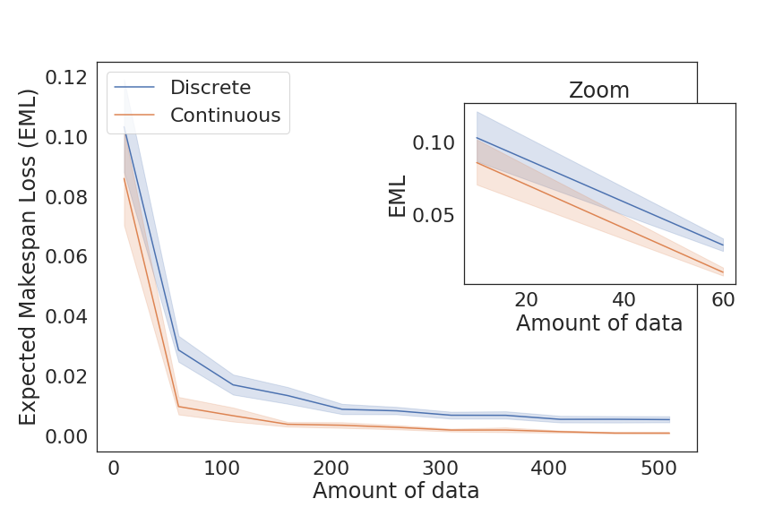

## Making Speculative Scheduling Robust to Incomplete Data
*Ana Gainaru, Guillaume Pallez (Aupy)* <br/>
Presented at: ScalA19: 10th Workshop on Latest Advances in Scalable Algorithms for Large-Scale Systems<br/>
Slides: [Link soon]

### Reproducability Initiative

Results are obtain by running the `compute_sequence_cost.py` script 100 times (truncnorm and expon):

```bash
for i in range{1..100}; do python compute_sequence_cost.py truncnorm; done
```
The Jupyter notebook is used to print the results



### System information

```
+ uname -a
Linux 7c983bb1f072 3.10.0-957.10.1.el7.x86_64 #1 SMP Mon Mar 18 15:06:45 UTC 2019 x86_64 x86_64 x86_64 GNU/Linux
+ lscpu
Architecture:        x86_64
CPU op-mode(s):      32-bit, 64-bit
Byte Order:          Little Endian
CPU(s):              8
On-line CPU(s) list: 0-7
Thread(s) per core:  1
Core(s) per socket:  1
Socket(s):           8
NUMA node(s):        1
Vendor ID:           GenuineIntel
CPU family:          6
Model:               60
Model name:          Intel Core Processor (Haswell, no TSX)
Stepping:            1
CPU MHz:             2294.686
BogoMIPS:            4589.37
Hypervisor vendor:   KVM
Virtualization type: full
L1d cache:           32K
L1i cache:           32K
L2 cache:            4096K
NUMA node0 CPU(s):   0-7
Flags:               fpu vme de pse tsc msr pae mce cx8 apic sep mtrr pge mca cmov pat pse36 clflush mmx fxsr sse sse2 ss syscall nx pdpe1gb rdtscp lm constant_tsc rep_good nopl eagerfpu pni pclmulqdq ssse3 fma cx16 pcid sse4_1 sse4_2 x2apic movbe popcnt tsc_deadline_timer aes xsave avx f16c rdrand hypervisor lahf_lm abm fsgsbase bmi1 avx2 smep bmi2 erms invpcid xsaveopt
+ cat /proc/meminfo
MemTotal:       16265800 kB
MemFree:          329752 kB
MemAvailable:    5289988 kB
Buffers:               4 kB
Cached:          4837252 kB
SwapCached:            0 kB
Active:         11918792 kB
Inactive:        2227476 kB
Active(anon):    9673916 kB
Inactive(anon):   198352 kB
Active(file):    2244876 kB
Inactive(file):  2029124 kB
Unevictable:           0 kB
Mlocked:               0 kB
SwapTotal:             0 kB
SwapFree:              0 kB
Dirty:               156 kB
Writeback:             0 kB
AnonPages:       9309216 kB
Mapped:           269468 kB
Shmem:            563128 kB
Slab:            1342496 kB
SReclaimable:    1024476 kB
SUnreclaim:       318020 kB
KernelStack:       19424 kB
PageTables:        57976 kB
NFS_Unstable:          0 kB
Bounce:                0 kB
WritebackTmp:          0 kB
CommitLimit:     8132900 kB
Committed_AS:   14244760 kB
VmallocTotal:   34359738367 kB
VmallocUsed:       38264 kB
VmallocChunk:   34359656108 kB
HardwareCorrupted:     0 kB
AnonHugePages:    239616 kB
CmaTotal:              0 kB
CmaFree:               0 kB
HugePages_Total:       0
HugePages_Free:        0
HugePages_Rsvd:        0
HugePages_Surp:        0
Hugepagesize:       2048 kB
DirectMap4k:      139132 kB
DirectMap2M:     4055040 kB
DirectMap1G:    14680064 kB
+ lsblk -a
NAME   MAJ:MIN RM  SIZE RO TYPE MOUNTPOINT
vda    253:0    0  160G  0 disk 
└─vda1 253:1    0  160G  0 part /home/ana/work/shared
```
