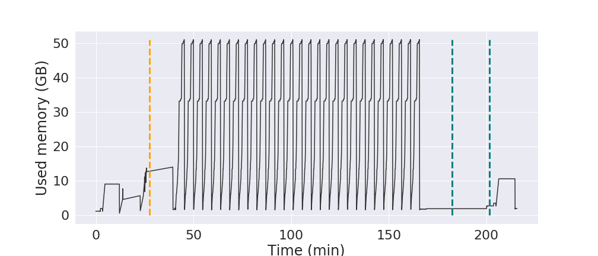

Scripts for running the Spatially Localized Atlas Network Tiles (SLANT) application with checkpointing enabled.

### Table of contents:
1. <a href="#Sec1"> Description of the software and applications used </a>
2. <a href="#Sec2"> Description of the used input data </a>
3. <a href="#Sec3"> Steps to configure the software and applications used </a>
4. <a href="#Sec4"> Description of all the scripts available in this repository </a>
5. <a href="#Sec5"> Description of the system where we ran the scripts </a>


<h1 id="Sec1">
1. Description of the software and applications used
</h1>
      
## SLANT


Link to the application executable: [https://github.com/MASILab/SLANTbrainSeg](https://github.com/MASILab/SLANTbrainSeg)

The application performs multiple independent 3D fully convolutional network for high-resolution whole brain segmentation. 

**Input**: a MRI imagine obtained by measuring spin–lattice relaxation times of tissues

SLANT has a GPU and a CPU version as well as different versions depending on whether the network tiles are overlapped or not.
In this repo you will find instructions on how to enable checkpointing for SLANT-27, the CPU version, in which the target
space is covered by 3 × 3 × 3 = 27 3D fully convolutional network. 

## Checkpoint tool


We used the CRIU external library to perform system level checkpointing of the Docker container
without changing the code of SLANT. With each execution of SLANT we are running a daemon in charge of triggering
checkpoints at given times.

Link to the source code for CRIU: [https://github.com/checkpoint-restore/criu
](https://github.com/checkpoint-restore/criu)

Intruction on how to install CRIU can be found here:  [https://criu.org/Installation
](https://criu.org/Installation) <br/>
I recommand building CRIU from source.

By default the checkpoint size limit for CRIU is 1GB. For SLANT you need to increase the limit to 51GB (wither in the CRIU configuration file for docker, as a parameter option if running CRIU independent of docker or manually in the source code). The experiments in this repo used the 3rd solution. Detail in the `Execution details` section below.

## Tool for generating the submission requests
<div id="sequence"></div>


We used an extension of the iSBatch tool to decide when to take the checkpoints for our executions.

Link to the source code for iSBatch: [https://github.com/anagainaru/iSBatch](https://github.com/anagainaru/iSBatch)

Input (for the inital isBatch): Container with past execution walltimes
<br/>*Optionally*: container with typical memory footprint of the application.

By default the iSBatch software is assuming a typical HPC platform where an application pays a cost during submission in the form of wait time in the scheduler's queue before execution and in the form of the failed reservations when the walltime/memory are underestimated. 

The sequence of reservations are generated according to the respective considered algorithm. We provide in folder `generate_sequences` an implementation that generate sequences for `MEM-ALL-CKPT` and `ALL-CKPT` (file [algorithm.py ](generate_sequences/algorithms.py) algorithms for a given lognormal distribution described in file [distri.py](generate_sequences/distri.py)).


<h1 id="Sec2">
2. Description of the used input data
</h1>

All the input files we used are listed and indexed in the `inputs` folder .They can be downloaded from the [OASIS-3](https://www.oasis-brains.org/) and Dartmouth Raiders Dataset ([DRD](http://datasets-dev.datalad.org/?dir=/labs/haxby/raiders)) datasets. Each data file is an MRI image.

We run SLANT on each input dataset and extract the memory footprint every 2 seconds using the following script:
```bash
while true; do sudo docker stats -a --no-stream >> stats.txt; sleep 2;  done
cat stats.txt | grep -v ID | cut -d" " -f10
```

The `SLANT_logs` folder contains examples of the memory footprint for 4 input datas from the DND dataset:

**ID 72**<br/> sub-rid000038_task-raiders_acq-8ch344vol_run-07_bold.nii.gz <br/>
**ID 80**<br/> sub-rid000042_task-raiders_acq-8ch344vol_run-07_bold.nii.gz <br/>
**ID 2**<br/> sub-rid000005_task-raiders_acq-8ch336vol_run-01_bold.nii.gz <br/>
**ID 81**<br/> sub-rid000043_task-raiders_acq-8ch326vol_run-04_bold.nii.gz

The IDs correspond to the filenames in the `SLANT_logs` folder.

If one is interested, all the runs performed on the Haswell platforms are available in `SLANT_logs/data_all_runs`. We provide the makespan for each input,
as so as the memory footprint associated to each run.

As we focus on studying the runs coming from DRD dataset, we also provide the logs of those inputs only in the folder `SLANT_logs/DRD_inputs`.


<h1 id="Sec3">
3. Steps to configure the software and applications used
</h1>

## Running SLANT

SLANT requires setting the input (where the input MRI needs to be stored) and output folders (where the generated files will be stored).
```bash
export input_dir=/path_to/input_dir
export output_dir=/path_to/output
```

We provide in this [script](batch.sh) the procedure to run SLANT using Singularity on Haswell platform. The [script for monitoring the memory](monitoring.sh) is also provided 

Checkpointing with Docker is experimental and proved not to be stable yet so we switched to the podman container engine  that is completely compatible with docker images.
Start the execution by running the SLANT docker image using podman
```bash
podman run --name slant -v $input_dir:/INPUTS/ -v $output_dir:/OUTPUTS vuiiscci/slant:deep_brain_seg_v1_0_0_CPU /extra/run_deep_brain_seg.sh &
```
      
## Taking checkpoints

To investigate the memory footprint of SLANT at any moment (to make sure the checkpoint size will be as desired):
`podman stats --no-stream | grep -v ID | cut -d" " -f10`

While the container is running, taking a checkpoint: `podman container checkpoint -l`

Once the checkpointing is finished, we get the checkpoint size:
```bash
du -h /var/lib/containers/storage/overlay-containers/{container_id}/userdata/checkpoint/
```

Restore a container:`podman container restore -l`

Once SLANT finished running we use: `sudo docker logs --latest | grep time` to gather the walltime for each phase of the application. Example output:
```
*******preprocessing time: 2839.628881 seconds
*******segmentation time: 7551.472055 seconds
Elapsed time is 189.978879 seconds.
Elapsed time is 2027.278245 seconds.
Elapsed time is 3159.428664 seconds.
*******postprocessing time: 3176.751577 seconds
*******generating pdf time: 50.718374 seconds
*******generating text file time: 17.091906 seconds
```
The application is divided into three main phases: i)
a preprocessing phase that performs transformations on the
target image ii) deep-learning phase iii) a post-processing phase doing label fusion
to generate final application result. 

The `take_checkpoins_size.sh` script can be used in the background to take checkpoints of fixed size in a given order (the sizes are hardcoded in the script). 


<h1 id="Sec4">
4. Description of all the scripts available in this repository
</h1>

**SLANT_logs**
<br/> Folder containing the application memory footprint for the 4 input data presented in <a href="#Sec2">section 2</a>.
There are two files for each input data, one for each of our testing platforms:

- the Haswell platform (`run[id]_inria.mem` files)
    - each line in each file has two entries: the second when the snapshot is taken and the corresponding size of the application

- the KNL platform (`run[id]`.mem files). 
    - each line represents the size of the application (with a frequency of 2 seconds)

We provide full results for each run on Haswell platform (memory footprints + makespan) in `data_all_runs` and `DRD_inputs` folders

**figures**
<br/> Folder containing performance information and examples generated by the jupyter notebooks. 

**generating_sequences**
<br/> Folder containing scripts used to generate the request sequences (See section <a href="#sequence"> Generate sequences </a> for details on how to use the script to generate the requests using the `ALL-CKPT` and `MEME-ALL-CKPT` algorithms)

**inputs**
<br/> Folder with the list of input files we used indexed for each dataset.

**README.md**
<br/> This file.

**SLANT_bandwidth.ipynb**
<br/> Jupyter notebook for reading the bandwith data stored in the `bandwidth` file and plotting it. Comments on how to use the jupyter notebook can be found inside. Example output:


**SLANT_memory.ipynb**
<br/> Script for reading the memory dump files in the `SLANT_logs` folder for one application for both the Haswell and the KNL platforms and plotting he memory usage throughout the execution of the application on each platform. Comments on how to use the jupyter notebook can be found inside. Example output for application 80 on the KNL platform:




**SLANT_walltime.ipynb**
<br/> Jupyter notebook to plot the execution time of different steps in the SLANT execution (preprocess, segmentation, postprocess) for the Haswell and KNL platforms. Comments on how to use the jupyter notebook can be found inside.

**bandwidth**
<br/> File with read and write bandwidth data for storing/reading the checkpoints
     - Each line of the file contains the Size of the checkpoint, the seconds it takes to store the checkpoint, the seconds it takes to read the checkpoint, Write Bandwith and Read Bandwidth.

**batch.sh**
<br/> Script that is used to launch SLANT on the Haswell platform using Singularity.

**monitoring.sh**
<br/> Script used to monitor SLANT application in order to extract the memory footprint of the application. The script is based on `vmstat` command, performed every 2 seconds until application terminates.

**take_checkpoints.sh**
<br/> Script that can be used as a daemon in the background to take checkpoints of fixed size in a given order (the sizes are hardcoded in the script). 


<h1 id="Sec5">
5. Description of the system where we ran the scripts
</h1>

## Machine configuration

We run the application on two different platforms:
- a 256-thread Knights Landing Intel Processor (Xeon Phi 7230, 1.30GHz, Quadrant/Cache mode) with 96GB of main memory for the checkpointed version of SLANT
- a Haswell platform composed of a server with 2 Dodeca-core Haswell Intel® Xeon® E5-2680 v3 @ 2,5 GHz with 128 Go of memory (5.3 Go/core) @2933 MHz for the profiling of the application


## Software configuration 

In this section you can find details of the software stack and platform configurations used to enable checkpointing for SLANT.

Software version on KNL platform:
```
$ uname -a
Linux PadmaLab 5.0.0-23-generic #24~18.04.1-Ubuntu SMP Mon Jul 29 16:12:28 UTC 2019 x86_64 x86_64 x86_64 GNU/Linux
$ sudo criu --version
Version: 3.13
$ sudo docker --version
Docker version 19.03.6, build 369ce74a3c
```

> **REMARK** If using a kernel for Ubuntu 18.04 higher than 5.0.0-32
> `echo '{ "experimental": true, "storage-driver": "devicemapper" }' > /etc/docker/daemon.json`
> `service docker restart`

The CPU version of SLANT can have a memory footprint of up to 50 GB.

> **REMARK** To change the default 1GB checkpoint size limit in CRIU when using Docker
> the DEFAULT_GHOST_LIMIT variable needs to be updated in the `criu/criu/include/cr_options.h`
> `#define DEFAULT_GHOST_LIMIT	(1 << 26) // 64G`

Software version on Haswell platform:
```
$ uname -a
Linux miriel064.plafrim.cluster 3.10.0-957.el7.x86_64 #1 SMP Thu Nov 8 23:39:32 UTC 2018 x86_64 x86_64 x86_64 GNU/Linux
$ singularity --version
singularity version 3.5.3-1.1.el7
```

SLANT application has been run over 312 different inputs. These inputs are extracted from OASIS-3 [https://www.oasis-brains.org/](https://www.oasis-brains.org/)
and Dartmouth Raiders Dataset (DRD) datasets [https://github.com/HaxbyLab/raiders_data](https://github.com/HaxbyLab/raiders_data). (see Section <a href="#Sec2">section 2</a>)
