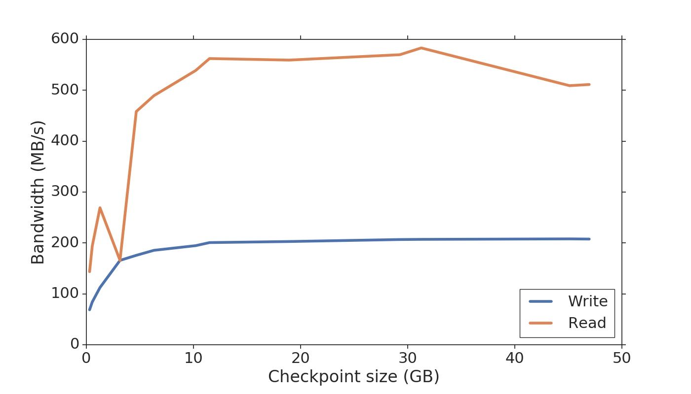

Scripts for running the Spatially Localized Atlas Network Tiles (SLANT) application with checkpointing enabled.

### Table of contents:
1. <a href="#Sec1"> Description of the software and applications used </a>
2. <a href="#Sec2"> Description of the used input data </a>
3. <a href="#Sec3"> Steps to configure the software and applications used </a>
4. <a href="#Sec4"> Description of all the scripts available in this repository </a>
5. <a href="#Sec5"> Description of the system where we ran the scripts </a>
6. <a href="#Sec6"> Short description on our performance results </a>


<h1 id="Sec1">
1. Description of the software and applications used
</h1>
      
## SLANT


Link to the application executable: [https://github.com/MASILab/SLANTbrainSeg](https://github.com/MASILab/SLANTbrainSeg)

The application performs multiple independent 3D fully convolutional network for high-resolution whole brain segmentation. 

**Input**: a MRI imagine obtained by measuring spin–lattice relaxation times of tissues

SLANT has a GPU and a CPU version as well as different versions depending on whether the network tiles are overlapped or not.
In this repo you will find instructions on how to enable checkpointing for SLANT-27, the CPU version, in which the target
space is covered by 3 × 3 × 3 = 27 3D fully convolutional network. 

## Checkpoint tool


We used the CRIU external library to perform system level checkpointing of the Docker container
without changing the code of SLANT. With each execution of SLANT we are running a daemon in charge of triggering
checkpoints at given times.

Link to the source code for CRIU: [https://github.com/checkpoint-restore/criu
](https://github.com/checkpoint-restore/criu)

Intruction on how to install CRIU can be found here:  [https://criu.org/Installation
](https://criu.org/Installation) <br/>
I recommand building CRIU from source.

By default the checkpoint size limit for CRIU is 1GB. For SLANT you need to increase the limit to 51GB (wither in the CRIU configuration file for docker, as a parameter option if running CRIU independent of docker or manually in the source code). The experiments in this repo used the 3rd solution. Detail in the `Execution details` section below.

## Tool for generating the submission requests


We used an extension of the iSBatch tool to decide when to take the checkpoints for our executions.

Link to the source code for iSBatch: [https://github.com/anagainaru/iSBatch](https://github.com/anagainaru/iSBatch)

Input (for the inital isBatch): Container with past execution walltimes
<br/>*Optionally*: container with typical memory footprint of the application.

By default the iSBatch software is assuming a typical HPC platform where an application pays a cost during submission in the form of wait time in the scheduler's queue before execution and in the form of the failed reservations when the walltime/memory are underestimated. 

*Add details on Valentin's script to compute the sequence*


<h1 id="Sec2">
2. Description of the used input data
</h1>

This repository contains examples of 4 input datas from the DND dataset, stored in the `SLANT_logs` folder. More input files can be downloaded from the [OASIS-3](https://www.oasis-brains.org/) and Dartmouth Raiders Dataset ([DRD](http://datasets-dev.datalad.org/?dir=/labs/haxby/raiders)) datasets.

The repo contains the results for the following inputs from the DND dataset 
 
**ID 72**<br/> sub-rid000038_task-raiders_acq-8ch344vol_run-07_bold.nii.gz <br/>
**ID 80**<br/> sub-rid000042_task-raiders_acq-8ch344vol_run-07_bold.nii.gz <br/>
**ID 2**<br/> sub-rid000005_task-raiders_acq-8ch336vol_run-01_bold.nii.gz <br/>
**ID 81**<br/> sub-rid000043_task-raiders_acq-8ch326vol_run-04_bold.nii.gz

The IDs correspond to the filenames in the `SLANT_logs` folder.


<h1 id="Sec3">
3. Steps to configure the software and applications used
</h1>

## Running SLANT

SLANT requires setting the input (where the input MRI needs to be stored) and output folders (where the generated files will be stored).
```bash
export input_dir=/path_to/input_dir
export output_dir=/path_to/output
```

Checkpointing with Docker is experimental and proved not to be stable yet so we switched to the podman container engine  that is completely compatible with docker images.
Start the execution by running the SLANT docker image using podman
```bash
podman run --name slant -v $input_dir:/INPUTS/ -v $output_dir:/OUTPUTS vuiiscci/slant:deep_brain_seg_v1_0_0_CPU /extra/run_deep_brain_seg.sh &
```
      
## Taking checkpoints (triggered by the user)

To investigate the memory footprint of SLANT at any moment (to make sure the checkpoint size will be as desired):
`podman stats --no-stream | grep -v ID | cut -d" " -f10`

While the container is running, taking a checkpoint: `podman container checkpoint -l`

Once the checkpointing is finished, we get the checkpoint size:
```bash
du -h /var/lib/containers/storage/overlay-containers/{container_id}/userdata/checkpoint/
```

Restore a container:`podman container restore -l`

Once SLANT finished running we use: `sudo docker logs --latest | grep time` to gather the walltime for each phase of the application. Example output:
```
*******preprocessing time: 2839.628881 seconds
*******segmentation time: 7551.472055 seconds
Elapsed time is 189.978879 seconds.
Elapsed time is 2027.278245 seconds.
Elapsed time is 3159.428664 seconds.
*******postprocessing time: 3176.751577 seconds
*******generating pdf time: 50.718374 seconds
*******generating text file time: 17.091906 seconds
```
The application is divided into three main phases: i)
a preprocessing phase that performs transformations on the
target image ii) deep-learning phase iii) a post-processing phase doing label fusion
to generate final application result. 

## Taking checkpoints (triggered by a dameon)
**If it's desired to take a snaphshot based on the memory footprint of SLANT**

To get the memory footprint of SLANT every 2 seconds: 
```bash
while true; do sudo docker stats -a --no-stream >> stats.txt; sleep 2;  done
cat stats.txt | grep -v ID | cut -d" " -f10
```
Example logs for running this commands can be found in the `SLANT_logs` folder.

The `take_checkpoins_size.sh` script can be used in the background to take checkpoints of fixed size in a given order (the sizes are hardcoded in the script). 

**If it's desired to take a snaphshot based on a given timestamp**

The `take_checkpoins.sh` script can be used in the background to take checkpoints during SLANT execution and fixed 
moments of time (currently the timestamps are hardcoded in the script). 

<h1 id="Sec4">
4. Description of all the scripts available in this repository
</h1>

TBD


<h1 id="Sec5">
5. Description of the system where we ran the scripts
</h1>

## Software configuration 

In this section you can find details of the software stack and platform configurations used to enable checkpointing for SLANT.

Software version:
```
$ uname -a
Linux PadmaLab 5.0.0-23-generic #24~18.04.1-Ubuntu SMP Mon Jul 29 16:12:28 UTC 2019 x86_64 x86_64 x86_64 GNU/Linux
$ sudo criu --version
Version: 3.13
$ sudo docker --version
Docker version 19.03.6, build 369ce74a3c
```

> **REMARK** If using a kernel for Ubuntu 18.04 higher than 5.0.0-32
> `echo '{ "experimental": true, "storage-driver": "devicemapper" }' > /etc/docker/daemon.json`
> `service docker restart`

The CPU version of SLANT can have a memory footprint of up to 50 GB.

> **REMARK** To change the default 1GB checkpoint size limit in CRIU when using Docker
> the DEFAULT_GHOST_LIMIT variable needs to be updated in the `criu/criu/include/cr_options.h`
> `#define DEFAULT_GHOST_LIMIT	(1 << 26) // 64G`

For testing, we run SLANT on 312 different inputs. These inputs are extracted from OASIS-3 [https://www.oasis-brains.org/](https://www.oasis-brains.org/)
and Dartmouth Raiders Dataset (DRD) datasets [https://github.com/HaxbyLab/raiders_data](https://github.com/HaxbyLab/raiders_data).

## Machine configuration

We run the application on a 256-thread Knights
Landing Intel Processor (Xeon Phi 7230, 1.30GHz, Quadrant/Cache mode) with 96GB of main memory.

<h1 id="Sec6">
6. Short description on our performance results
</h1>

The average read and write time for taking different checkpoint sizes for SLANT on the Knight Landing platform.



