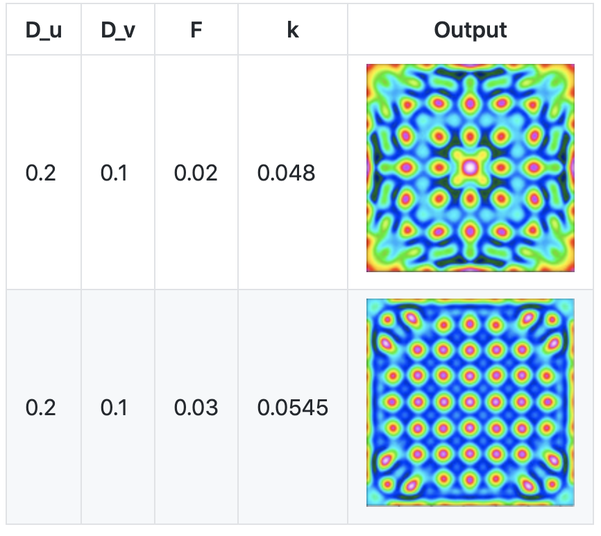

# Data staging for coupled simulation workflows

### Table of contents:
1. <a href="#Sec1"> Description of the system </a>
1. <a href="#Sec2"> Description of the codes and applications used </a>
2. <a href="#Sec3"> Description of the used input data </a>

<h1 id="Sec1">
1. Description of the system
</h1>

All experiments have been done on the Summit supercomputer at ORNL. 
Summit contains two IBM POWER9 processors, each with 22 SIMD Multi-Core, each capable of supporting up to 4 hardware threads.
The nodes used for our experiments contain 512 GB of DDR4 memory for use by the POWER9 processors and 1.6TB of non-volatile memory that can be used as burst buffers.
For most experiments we use 24 processes per node. A detailed description of the system architecture can be found [here](https://www.olcf.ornl.gov/summit/)

All the batch scripts used for submitting the jobs on Summit are in each application's individual folder.

Unless otherwise specified, the default versions for all the software used:
```
GCC version
gcc (GCC) 6.4.0
CMAKE version
cmake/3.18.2 
```

<h1 id="Sec2">
1. Description of the software and applications used
</h1>

Experiments are made using simulations using the codes in `simulation` and two applications:
- **XGC** Gyrokinetic Particle Simulation of Edge Plasma
- **Gray-Scott** reaction diffusion model

### Gray-Scott reaction diffusion model



The code can be found in the `Gray-Scott` folder. It represents a 3D 7-point stencil code to simulate the following [Gray-Scott
reaction diffusion model](https://doi.org/10.1126/science.261.5118.189):
```
u_t = Du * (u_xx + u_yy + u_zz) - u * v^2 + F * (1 - u)
v_t = Dv * (v_xx + v_yy + v_zz) + u * v^2 - (F + k) * v
```
Basis from the code can be found at [https://github.com/pnorbert/adiosvm/tree/master/Tutorial/gray-scott](https://github.com/pnorbert/adiosvm/tree/master/Tutorial/gray-scott)

Installing the application:
```
mkdir build
cd build
cmake -D adios2_ROOT=/ccs/home/againaru/adios/ADIOS2-init/install/lib64/cmake -DCMAKE_CXX_COMPILER=g++ -DCMAKE_C_COMPILER=gcc ..
make
```
Changing the problem size can be done in the `simualtion/settings.json` file by changing the value of variable L. 

The scripts used to run the code using files or staging on Summit can be fund in `Gray-Scott/submit_summit.sh`.

### XGC


XGC is a particle-in-cell (PIC) numerical simulation code for modelling plasma edge physics, including a tokamak’s X-point. It solves the gyromagnetic equations, where the domain is divided into discrete (cross-sectional) poloidal planes about the torus, representing field data on a fixed unstructured triangular mesh in each plane.

Requesting access to the XGC code can be done at: [https://xgc.pppl.gov/html/getting_xgc.html](https://xgc.pppl.gov/html/getting_xgc.html).
The experiments used the development branch of the main repository.

Instructions on how to compile XGC together with VTK-m can be found at [https://github.com/anagainaru/ADIOS2-addons/tree/main/DataStreaming/XGC](https://github.com/anagainaru/ADIOS2-addons/tree/main/DataStreaming/XGC)

Scripts for compiling and running XGC and VTK-m on Summit are in the `XGC` folder.

### Simulations


The simulation codes are iterative processes implementing the methodology described in the figure on the right. Writers compute using a DoCompute function then write data. Readers read data, prepare it for the analysis with DoPrepare and compute using DoAnalysis function.

To build the codes:
```bash
mkdir build
cd build
cmake -D adios2_ROOT=/path/to/ADIOS/install ..
make -j4
```

**Experiments**
1. Strong/Weak scaling experiments for measuring the IO time. Scripts for these are in `simulation/weak_*.sh` and `simulation/strong_*.sh` (*Figure 6*)
2. Bandwidth measurements. Scripts in `simulation/read_bw*.sh` and `simulation/write_bw*.sh` (*Figure 9*)
3. Inline algorithms. All the experiments involving the inline algorithm use the code in `simulation/iReadWriter.cpp`.
4. Medical applications are simulated by using the codes and scripts in `simulation/medical*`
